# Introduction
Hi, In this tutorial, we will learn how to mint NFTs on Tezos. We will write a smart contract in SmartPy and deploy it, upload the NFT metadata on IPFS and mint the token using better-call.dev. We will also cover how to mint it using React and taquito.


# Prerequisites

- Basic Knowledge of SmartPy
- React


# Requirements

- Temple Wallet Installed in your browser. Get it from https://templewallet.com/
- Few XTZs on Granada Testnet is also needed in the wallet account. To get it, you can refer to Faucet and Temple Wallet section in this [tutorial](https://learn.figment.io/tutorials/using-the-smartpy-ide-to-deploy-tezos-smart-contracts#faucet-and-temple-wallet).
- NodeJS, npm and git are also needed for the frontend.

# SmartPy

SmartPy is an intuitive and powerful smart contract development platform for Tezos.  
The SmartPy language is available through a Python library for building and analyzing Tezos smart contracts.  
And with its IDE, we can quickly write our code in the browser itself. We can also deploy our code from the browser. No local setup is required.  
Open https://smartpy.io/ide 

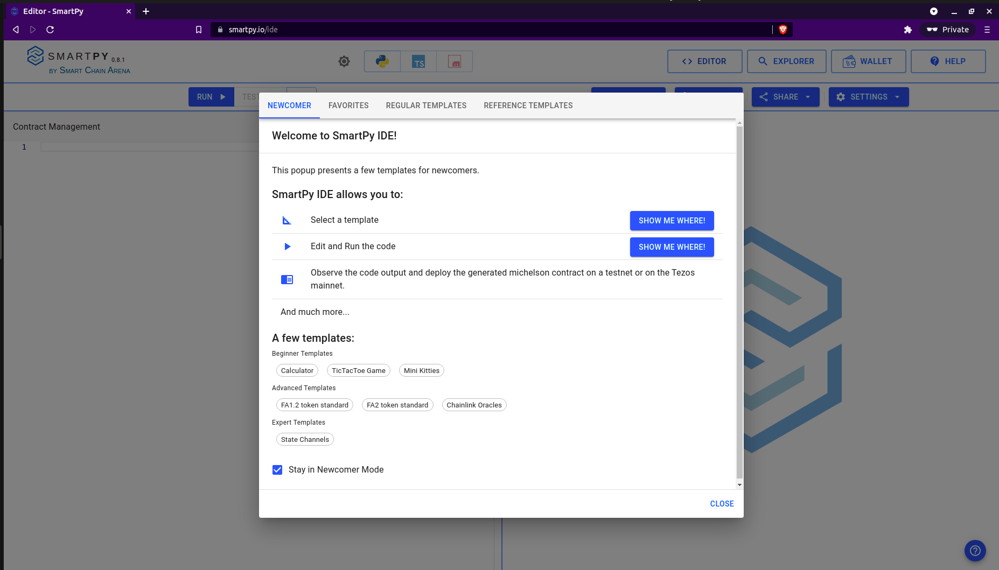

You can explore and look at the template codes given.  
To move to the editor, click CLOSE.

# Token Contract and FA2 Standard

The left panel is where we are going to code.  
We are going to follow the FA2 token standard(TZIP-12) for our NFTs.  
Let’s start coding our contract.

First, we will import the smartpy library

```python
import smartpy as sp
```

Now we will import the FA2 template. Most of the features(mint) we needed have already been implemented in this template. 

```python
FA2 = sp.io.import_template("FA2.py")
```

Let’s use this template and inherit it in our NFT class, and the entry points we needed for this tutorial are already in the template, so we don’t need to change our class and simply pass. And this will be our contract.

```python
class NFT(FA2.FA2):
   pass
```

Let’s write some tests for our contract.

We need some test accounts for tests; let's add two test accounts, Tom and Jerry. And as we also need to set admin for our contract, we require that also. For admin also, you can use a test account and set your address as admin later from storage JSON while deploying, but I prefer putting it in tests itself. 
```python
@sp.add_test(name="tests")
def test():
   jerry = sp.test_account("Jerry")
   tom = sp.test_account("Tom")
   admin = sp.address("tz1aV2DuPYXEK2mEVc4VBhP9o4gguFGxBky4")
```

Change the address inside the sp.address to your address(your wallet account public key).

For tests, we need to create test_scenario and assign a heading to it using h1.

```python
   scenario = sp.test_scenario()
   scenario.h1("tutorial tests")
```

Now we will originate our NFT contract. As we inherit the FA2 template, we need to understand what parameters we need to send and can change that according to our needs. 
We set non_fungible to true in the FA2_config, pass the admin address and set the metadata of the contract. For metadata, we will use big_map, in which first we set where to look for the metadata. Here from tezos-storage:content we can understand we need to look for content in the storage. And in storage, we will define the metadata. We will define the name and description.   
You can refer to [TZIP-16](https://tezostaquito.io/docs/metadata-tzip16/) for more details on contract metadata. 


```python
   nft = NFT(FA2.FA2_config(non_fungible=True), admin=admin, metadata= sp.big_map({"": sp.utils.bytes_of_string("tezos-storage:content"),"content": sp.utils.bytes_of_string("""{"name": "Tutorial Contract", "description": "NFT contract for the tutorial"}""")}))
```

Add the nft to scenario

```python
   scenario += nft
```

Test the mint function.   
We are going to send three parameters to the mint entry point.

- token_id  
the token id of the NFT usually stars with 0 and then needs to be increment by 1 for each subsequent NFT.

- address  
the address on which we want to mint the token.

- metadata  
for token metadata, we are using IPFS (will come to it later in this tutorial). 
The metadata is stored in a map(string, bytes) so, we need to convert the strings to IPFS for which sp.utils.bytes_of_string is used. 

And only the admin can run the mint query.

```python
   nft.mint(token_id=0, address=jerry.address, amount=1, metadata = sp.map({"": sp.utils.bytes_of_string("ipfs://bafkreih36m3d4yfbpyteluvntuph5xybwtgxdvyksbgyg66es44drk4hqy")})).run(sender=admin)
```

This is our contract.  
Here's the whole code you can refer to: 

```python
import smartpy as sp
FA2 = sp.io.import_template("FA2.py")
 
class NFT(FA2.FA2):
   pass
 
@sp.add_test(name="tests")
def test():
   jerry = sp.test_account("Jerry")
   tom = sp.test_account("Tom")
   admin = sp.address("tz1aV2DuPYXEK2mEVc4VBhP9o4gguFGxBky4")
   scenario = sp.test_scenario()
   scenario.h1("tutorial tests")
   nft = NFT(FA2.FA2_config(non_fungible=True), admin=admin, metadata= sp.big_map({"": sp.utils.bytes_of_string("tezos-storage:content"),"content": sp.utils.bytes_of_string("""{"name": "Tutorial Contract", "description": "NFT contract for the tutorial"}""")}))
   scenario += nft
   nft.mint(token_id=0, address=jerry.address, amount=1, metadata = sp.map({"": sp.utils.bytes_of_string("ipfs://bafkreih36m3d4yfbpyteluvntuph5xybwtgxdvyksbgyg66es44drk4hqy")})).run(sender=admin)

```

Run the code using the RUN button above the left(editor) panel or can use ctrl+enter also, cmd+enter for mac.

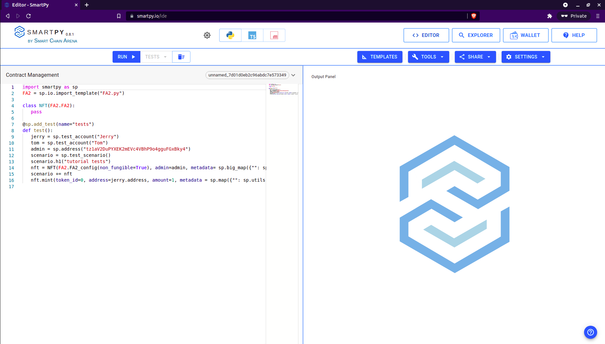

If there are no errors, we will get the output in the right terminal.   
We can check it according to the tests defined. We defined the heading in h1 in tests as “tutorial tests”, so we can see that on the top. Other than that, we can look at the NFT contract and on scrolling, we can see the mint transaction as defined in the tests. So this looks perfect, and our contact is working correctly. 

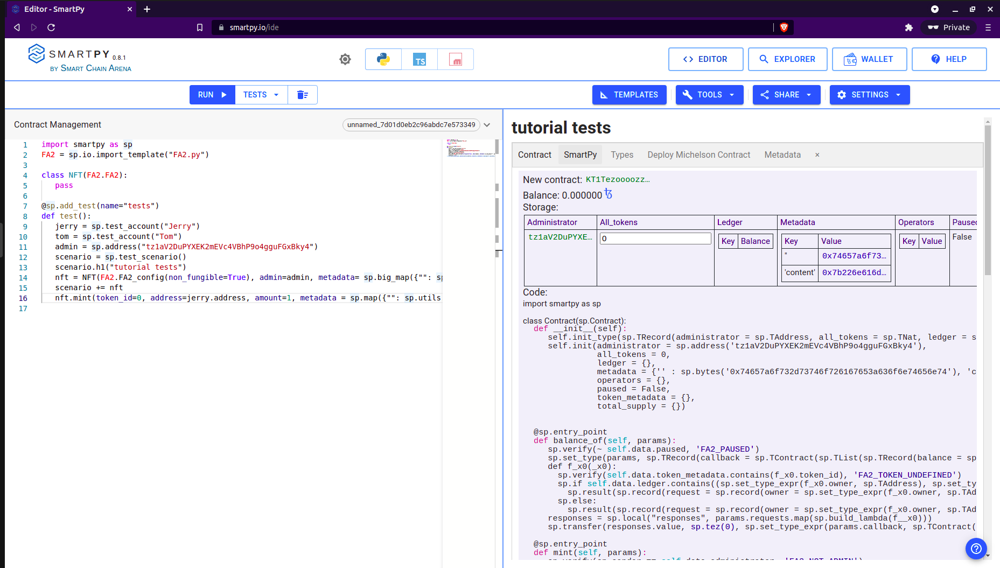

# Deploy Contract

It’s time to deploy this contract. For this tutorial, we are going to deploy the contract Granada testnet.  
We can deploy the contract using smartpy ide itself. 
After running, we get the option to Deploy Michelson Contract in the output panel. Move to it.

Click on the Deploy Michelson Contract.

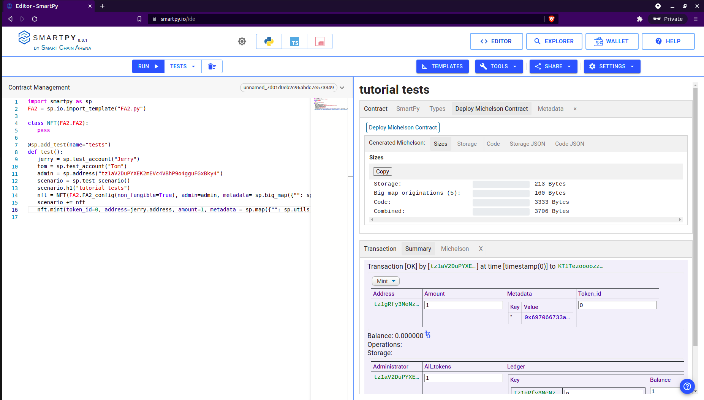

A new tab will open up.

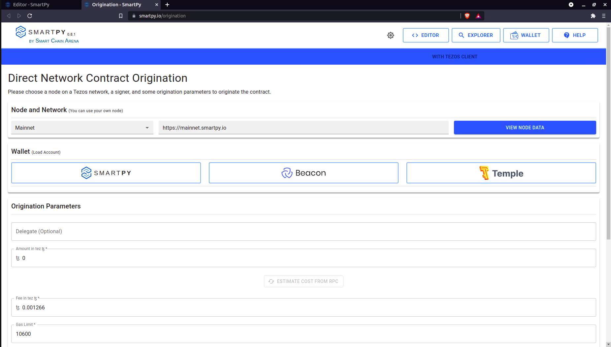

Choose Granadanet in the Node. Now Click on Temple Wallet. Choose one account (if you have multiple). And then press connect. 

Account loaded with success will come.
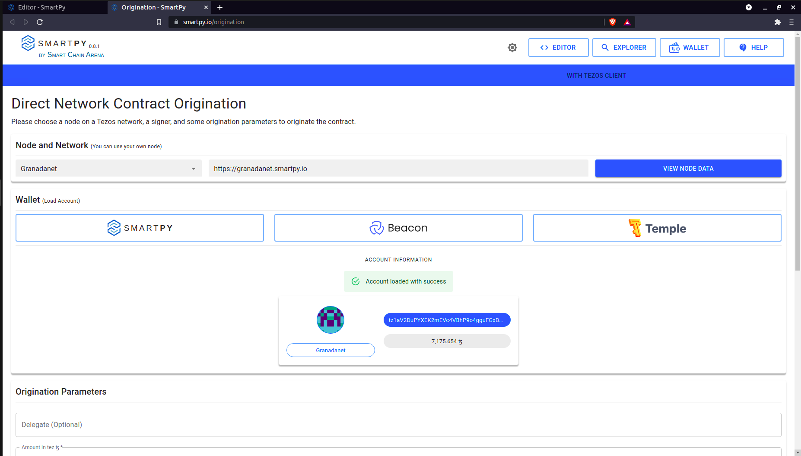

Scroll down below and click on Estimate Cost From RPC. It will refresh the cost. And after that, click on the DEPLOY CONTRACT button.
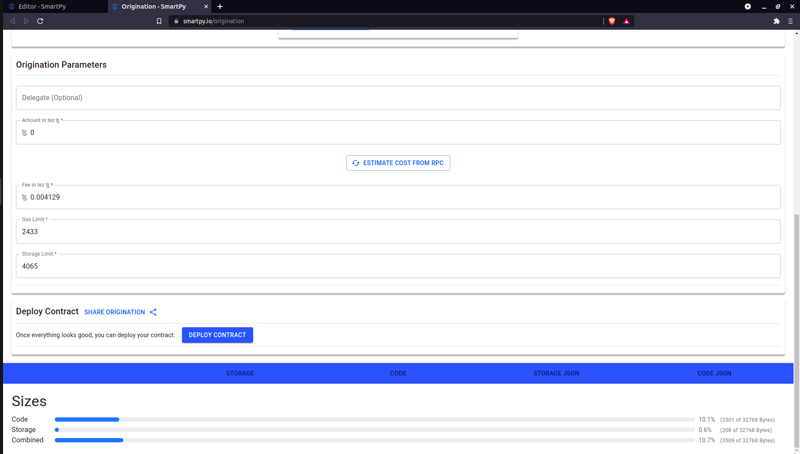

Accept the pre-signature information.

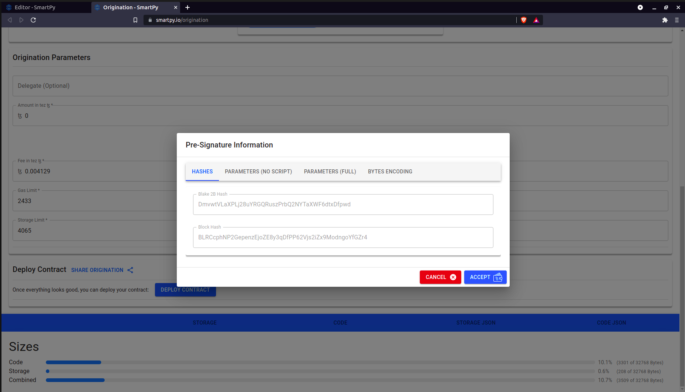

Then your wallet popup will come. Press sign.

Contract Originated Successfully will be shown. Copy the contract address(KT1Rv5Nvc4A2e4hTHi34QhChYFdJ2aBjAp7P) and store it. 

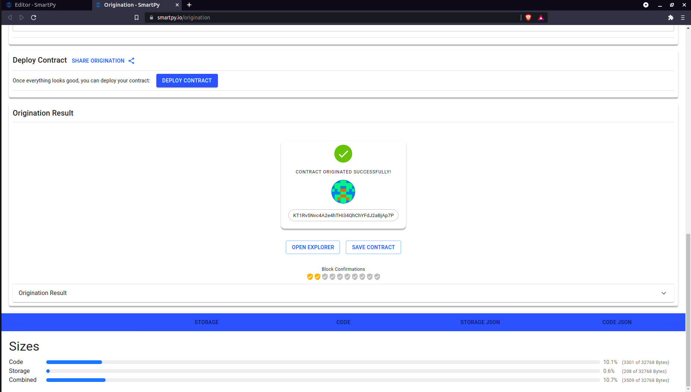

Hurray, we deployed our contract successfully.

# IPFS

IPFS is a distributed system for storing and accessing files, websites, applications, and data.  
And, we will use IPFS to store the metadata of our tokens. And to upload our files to IPFS, we will use nft.storage. It provides us with a user interface and also a js library to upload files.  
In this tutorial, we will create a NFT of an image. Firstly, we will upload the image and then use the image hash in the token metadata.
So to upload files, visit [nft.storage](https://nft.storage/).

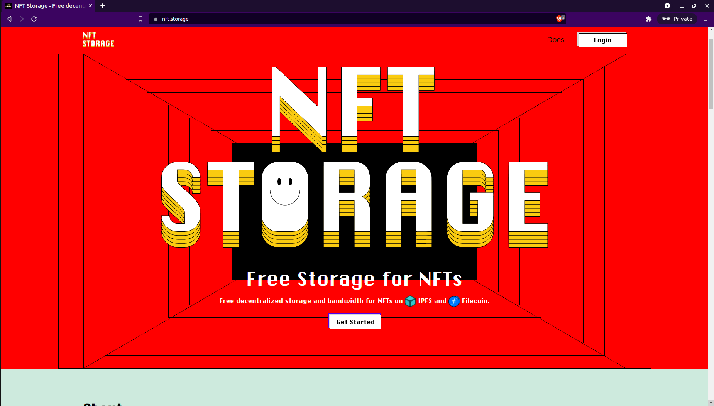

Log in and click on upload and choose the image file you want to upload and upload.

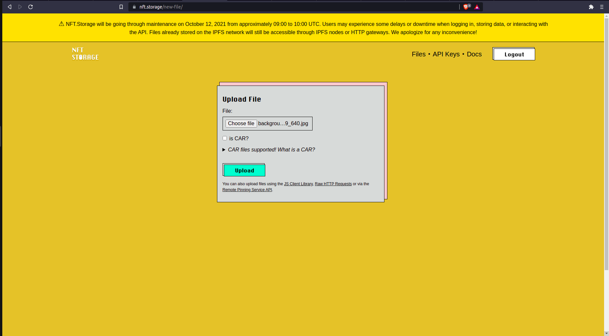


Upload it now.  
The file will get uploaded, and this is your hash.

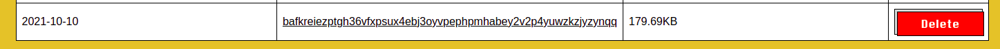

You can view your files visiting ipfs://<hash> (If your browser doesn’t support IPFS, you can use https://ipfs.io/ipfs/<hash> )

For token metadata, decimals is the required field according to the FA2 standard.  
name and symbols fields are highly recommended.
And according to TZIP-21 for NFTs, these are some other recommended fields 
- artifactUri
- displayUri
- thumbnailUri
- description
- minter
- creators
- isBooleanAmount

We will be storing the metadata in JSON file. Create metadata.json and open it in any editor of your choice.

We will be storing the metadata in JSON file. Create metadata.json and open it in any editor of your choice.

```json
{
    "name": "First NFT",
    "symbol": "TUT",
    "description": "First NFT",
    "decimals": 0,
    "isTransferable": true,
    "shouldPreferSymbol": false,
    "isBooleanAmount": true,
    "artifactUri": "ipfs://bafkreiezptgh36vfxpsux4ebj3oyvpephpmhabey2v2p4yuwzkzjyzynqq",
    "displayUri": "ipfs://bafkreiezptgh36vfxpsux4ebj3oyvpephpmhabey2v2p4yuwzkzjyzynqq",
    "thumbnailUri": "ipfs://bafkreiezptgh36vfxpsux4ebj3oyvpephpmhabey2v2p4yuwzkzjyzynqq",
    "creators": [
        "priyanshu"
    ]
}
```

Here, we will be using the same IPFS link for artifactUri, displayUri and thumbnailUri.  
For NFTs, decimals must be 0, as you are the minter you can put your address there and creators is an array of string and isBooleanAmount is boolean, and it describes whether an account can have an amount of exactly 0 or 1.  
There are other fields also which can be used. You can read the details of all this in the TZIP-21.

Now we will upload this JSON file to IPFS using nft.storage.

**Small Exercise:-**  
Repeat the same procedure we did to upload the image and upload this file and store the hash that will be needed later and view the file in a browser using the link. 

# Mint using better-call.dev

